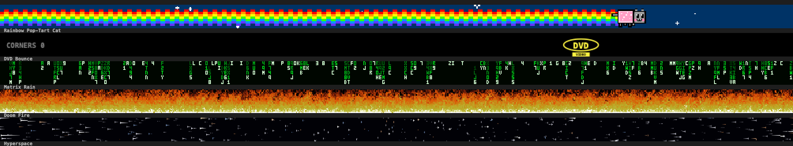
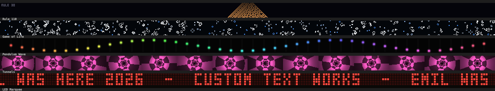
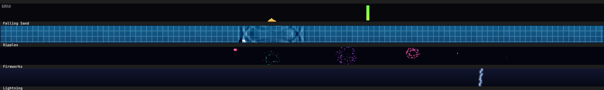
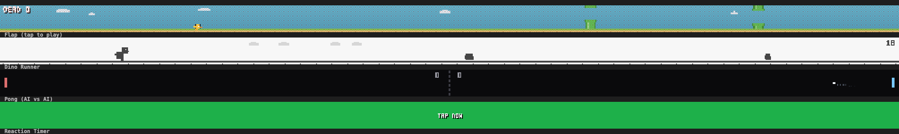
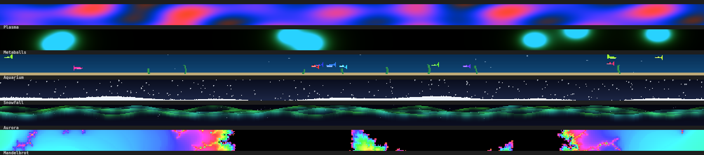
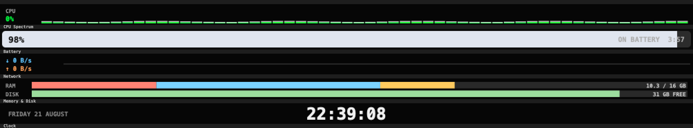
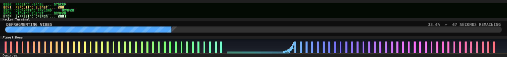

# Touch Bar Toys

[](https://github.com/LegoClient/TouchBarToys/actions/workflows/build.yml)

Thirty-two pointless, flashy things for the MacBook Pro Touch Bar — screensavers,
demoscene effects, small games and a few real system monitors.

Native Swift, no dependencies, builds with Command Line Tools. No Xcode required.




## Requirements

- A Mac with a Touch Bar (developed on a MacBook Pro 16", macOS 26.1, Intel)
- Xcode Command Line Tools — `xcode-select --install`

CI also builds it on Apple Silicon (macOS 26.5, Swift 6.3, `arm64`), so the
source is architecture-clean — but the Touch Bar hardware only ever shipped on
Intel MacBook Pros, so that's the only place it can actually run.

No Xcode, no package manager, no dependencies.

## Install

**Download** the latest build from
[Releases](https://github.com/LegoClient/TouchBarToys/releases/latest), unzip,
and drag it to `/Applications`. It's x86_64, because every Mac with a Touch Bar
is an Intel Mac.

macOS will refuse to open it the first time — the app is ad-hoc signed, not
notarized. Open it once, let macOS block it, then go to **System Settings →
Privacy & Security**, scroll down and click **Open Anyway**. Once only.

**Or build it**, which takes about ten seconds and skips the Gatekeeper prompt
entirely, because locally built apps are never quarantined:

```bash
git clone https://github.com/LegoClient/TouchBarToys.git
cd TouchBarToys && ./build.sh && cp -R build/TouchBarToys.app /Applications/
open /Applications/TouchBarToys.app
```

The app is a menu-bar accessory — no Dock icon, no window. It ad-hoc signs
itself during the build.

### Cutting a release

The release artifact has to be built on an Intel Mac (or cross-compiled) — CI
runners are arm64, and an arm64 build is useless on Touch Bar hardware.

```bash
./build.sh
ditto -c -k --sequesterRsrc --keepParent build/TouchBarToys.app TouchBarToys.zip
gh release upload vX.Y.Z TouchBarToys.zip
```

`ditto` rather than `zip`, so the code signature survives the round trip.

## Use

A 🌈 sits in your menu bar, and a small rainbow icon in the Control Strip at the
right of the Touch Bar.

| | |
|---|---|
| **Left-click the menu bar 🌈** | open / close the scene on the Touch Bar |
| **Right-click the menu bar 🌈** | menu — pick a scene, toggles, quit |
| **Tap the Control Strip icon** | same as left-clicking the menu bar icon |
| **◀ ▶ on the bar** | previous / next scene |
| **✕ on the bar** | close |

Menu options:

- **Full Screen** — drops the three buttons so the scene spans the whole bar
  (1050pt instead of 812pt). Taps then go to the scene itself, so exit via the
  Control Strip icon or the menu bar 🌈, and switch scenes from the menu.
- **Keep Icon in Control Strip** — pins/unpins the Touch Bar icon. See
  [Control Strip](#the-control-strip-needs-more-than-the-api-suggests) below for
  what this changes.
- **Edit Marquee Text…** — opens
  `~/Library/Application Support/TouchBarToys/marquee.txt`. One message per line;
  tap the bar to cycle them. Re-read every 2s, so edits show up live. The 3×5
  font covers A–Z, 0–9 and a little punctuation; anything else becomes a space.
- **Launch at Login** — installs a user LaunchAgent (not `SMAppService`, which
  wants a Developer ID signature).

The animation only runs while the bar is open, so it costs nothing when idle.

## The scenes

**Classics** — Rainbow Pop-Tart Cat · DVD Bounce (counts real corner hits) ·
Matrix Rain · Doom Fire† · Hyperspace†

**Made for the Strip** — Rule 110† (elementary cellular automata) · Game of
Life† · Pendulum Wave† · Tunnels† · LED Marquee†

**Touch** — Falling Sand† (sand / water / stone) · Ripples† · Fireworks† ·
Lightning†

**Games** — Flap† · Dino Runner† · Pong (plays itself) · Reaction Timer†

**Ambient** — Plasma† · Metaballs† · Aquarium† · Snowfall† · Aurora† ·
Mandelbrot†

**System** — CPU Spectrum · Battery · Network · Memory & Disk · Clock†

**Silly** — Hacker Terminal† · Almost Done† · Dominoes†

† responds to touch.

<details>
<summary>More screenshots</summary>







</details>

## Adding a scene

One class conforming to `Toy`, plus a line in the registry in
`Sources/Toys/Toy.swift`.

```swift
final class MyToy: PixelToy {
    override var title: String { "My Toy" }
    override var emoji: String { "🎃" }
    override var pixelHeight: Int { 30 }   // virtual canvas height

    override func update(dt: Double, size: CGSize) { /* advance state */ }
    override func renderPixels(into buf: PixelBuffer) { /* plot chunky pixels */ }
    override func tap(at p: CGPoint, size: CGSize) { /* optional */ }
}
```

`PixelToy` gives you a low-resolution `PixelBuffer` that gets scaled up with
nearest-neighbour, which is what makes everything look like a 1998 screensaver.
Conform to `Toy` directly instead if you want to draw into the real `CGContext`
at full resolution — `DVDToy`, `ClockToy` and the system monitors do that.
`MicroFont` is a 3×5 pixel font for scores and labels; `Text` draws crisp
CoreText for anything larger.

## Development

The Touch Bar can't be screenshotted from a script — it isn't a CoreGraphics
display, and the `Cmd+Shift+6` shortcut needs Accessibility permission. So there
is an offscreen renderer that draws every scene at Touch Bar geometry. All the
pixel art was tuned through it, without a Touch Bar in the loop.

```bash
swiftc -O -o build/render Sources/Toys/*.swift Sources/Render/main.swift
./build/render preview      # per-group contact sheets + a PNG of every scene
./build/render x --bench    # per-frame cost of every scene
```

At 30fps the heaviest scene (Mandelbrot) is ~10% of one core and most are under
1%. Anything above ~10% in `--bench` is worth a look.

The app itself has several diagnostic modes, which exist because most of the
bugs in this project were invisible:

```bash
./build/TouchBarToys.app/Contents/MacOS/TouchBarToys --selftest
```

| mode | what it does |
|---|---|
| `--selftest` | drives the whole Touch Bar path headlessly and reports whether the canvas actually made it onto the bar |
| `--testbuttons` | presents the bar, fires the real button handlers, checks they changed something |
| `--testmenu` | opens the menu and fires a row's action through the real code path |
| `--diag` | menu model, resolved colours, Control Strip registration |
| `--menumock` | renders the menu rows offscreen to `/tmp/tbt-menu-mock.png` |
| `--fontprobe` | glyph lookup plus rasterised ink counts |
| `--menushot` | captures live windows (**unreliable for text** — see below) |

Every launch also writes a trace to `~/Library/Logs/TouchBarToys.log`.

## How it works

macOS has no public API for putting your own content on the Touch Bar outside
your own app's window. Three private entry points do it, and all three still
exist on macOS 26.1:

- `+[NSTouchBarItem addSystemTrayItem:]` — registers an item with the system tray
- `DFRElementSetControlStripPresenceForIdentifier()` — pins it into the Control Strip
- `+[NSTouchBar presentSystemModalTouchBar:placement:systemTrayItemIdentifier:]` —
  takes over the whole bar (`placement: 1`)

The Objective-C methods are declared as categories in `Sources/App/PrivateAPI.h`;
a declaration is enough, because ObjC dispatch needs no link-time symbol.
`DFRFoundation` has no linkable stub — it exists only in the dyld shared cache —
so its C functions are resolved with `dlsym`. `TouchBarSPI.missing` checks all
three at launch and shows a plain error instead of crashing if a future macOS
drops one.

## Field notes

Most of the work here went into things that fail silently. Written down in case
they save someone else the afternoon.

### Anything AppKit draws for you may not appear

In this app, `NSMenuItem` titles render as **nothing** on macOS 26 — rows,
separators and checkmarks draw, the text never does. Everything checks out at
runtime: all titles present, `labelColor` white at 0.85 alpha, `.SFNS-Regular`
resolving glyphs, and text rasterising to 410 ink pixels in an offscreen bitmap
through every drawing path. Setting `NSApp.mainMenu` (a nib-less app has none)
did not help.

It isn't limited to text or to menus. `NSButton` renders nothing at all — not a
title, not a symbol image, not even its bezel. The ✕ ◀ ▶ items and the Control
Strip icon were all empty slots.

The rule that holds: **anything you draw yourself in an `NSView` renders; stock
controls may not.** `MenuRowView` and `BarButtonView` draw their own labels,
checkmarks, glyphs and highlights with Bezier paths, and everything appears.

### Drawing it yourself costs you the events too

A custom `NSView` in the Touch Bar receives **no touches at all** until it sets
`allowedTouchTypes = [.direct]`, and taps then arrive as
`touchesBegan`/`touchesEnded`, not `mouseDown`/`mouseUp`. `NSControl` does this
internally, so it is easy to miss — the hand-drawn buttons looked perfect and
were completely inert.

### `cacheDisplay` on a menu window drops text

Rendering a live menu window with `cacheDisplay(in:to:)` captures emoji — which
are image glyphs — and no text whatsoever. It looks exactly like a font bug that
isn't there. Use `--menumock` to check row drawing offscreen instead.

### NSTouchBar layout fails silently in two different directions

`NSTouchBar` sizes custom views from their constraints. A flexible width
collapses the canvas to 0pt. A width that makes the item row even slightly too
wide makes the bar **silently decline to lay it out** — the view gets a window
but never draws a frame. On this machine the ceiling was ~950pt beside two stock
buttons, ~880pt beside the drawn ones, and ~812pt once ◀ was added, which is the
default.

Full-screen mode can't be calibrated the same way. With a *single* item the bar
**clips** an oversize canvas instead of refusing it, so a 1400pt canvas still
reports a healthy 30fps while running off the edge — the zero-frames check is
blind. Its 1050pt is derived from the button-mode measurements instead: a total
item row of ~1070pt laid out, ~1080pt did not. `TBT_CANVAS_WIDTH` and
`TBT_FULL_WIDTH` override both for tuning.

### Presenting the bar is not reliable

While a menu is open the Touch Bar shows that menu's own context, and anything
presented during it is discarded when the context is restored — which is why
"Show on Touch Bar" did nothing at all. `presentBar(attempt:)` therefore treats
presentation as unreliable: it checks 0.8s later whether the canvas actually drew
a frame and retries if not, shrinking the width only once a straight retry has
failed (a too-wide row won't fix itself on a retry; a stolen bar will). Menu rows
also wait 0.3s after `cancelTracking()` before firing their action.

### The Control Strip needs more than the API suggests

`DFRElementSetControlStripPresenceForIdentifier` makes an item *available*, but
once you have customised your Control Strip the Touch Bar renders exactly the
identifier list stored in `com.apple.controlstrip` — `FullCustomized` for the
expanded strip, `MiniCustomized` for the collapsed one — and ignores anything
not in it. "Keep Icon in Control Strip" inserts and removes the identifier there
and restarts `ControlStrip` to reload the layout.

## Uninstall

```bash
# quit, remove the app and the login item
pkill -f TouchBarToys
rm -rf /Applications/TouchBarToys.app
launchctl bootout gui/$UID/com.touchbartoys.app 2>/dev/null
rm -f ~/Library/LaunchAgents/com.touchbartoys.app.plist
```

Then unpin the Control Strip icon — check whether it's listed:

```bash
defaults read com.apple.controlstrip FullCustomized
```

and if `com.touchbartoys.app.strip` is there, remove it from `FullCustomized`
and `MiniCustomized`, then `killall ControlStrip`. Toggling **Keep Icon in
Control Strip** off before you uninstall does this for you.

## Caveats

This app depends on private API. A macOS update could break it without warning —
if that happens you get a plain "can't run on this macOS" dialog naming the
missing symbol, and `--selftest` will tell you which part gave out. It is
ad-hoc signed, so it will not pass notarisation and is not meant to be
distributed as a binary.

## License

MIT — see [LICENSE](LICENSE).
